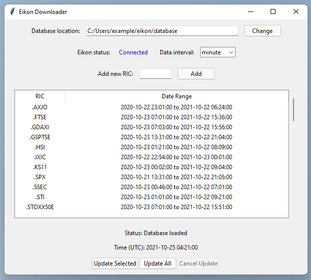
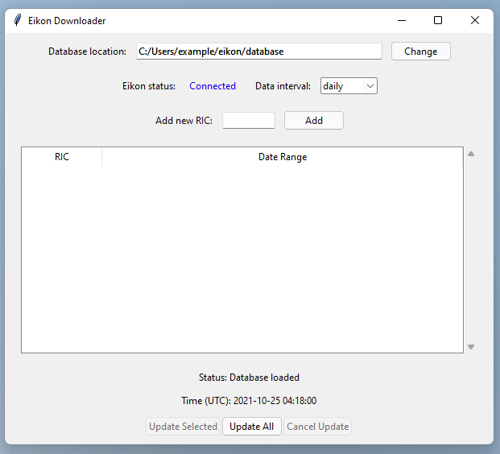
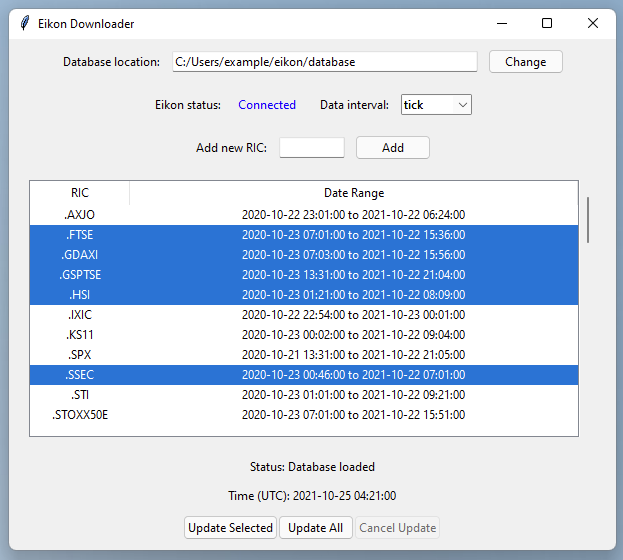

# Eikon time series downloader tool

## Introduction

During our research, we decided to analyse time series provided by the Eikon database/software.
Eikon allows a limited amount of time series data to be downloaded via a Python package.
The package, however, often spits out errors when requesting data as the package only allows very small chunks of data to be downloaded at a time.
To make the user experience of downloading data a bit simpler, and to make sure that the requests for data remain within the allowed limits of the software, I created this small application to help download time series.



## Setup

### Eikon requirements

Most importantly, an **Eikon subscription** with access to the **Eikon Python Data API** is required.
Then the **Eikon software** itself must be installed *and running* for this downloader tool to work.
The last Eikon requirement we have is to create an **Eikon App ID** to use the Python Data API.
This is easily created inside the Eikon software.
Type in "APPKEY" in the Eikon search bar and use the resulting App Key Generator to register a new app.

I ran Eikon and tested this downloader tool on **Windows**.
In theory, the Eikon Python Data API is accessible on macOS if some other Eikon software is installed and running, but I could not get access to the relevant Mac software to try this.

### Python requirements

The downloader tool requires **Python** to run and the **Eikon Python package** (`pip install eikon`).
If Python is not already installed, Anaconda is the simplest way to install it alongside other relevant data science software.
If the Eikon Python package itself does not install it, then you may need to install the **pandas** Python package (`pip install pandas`).

### User authentication to Eikon

The downloader tool follows the standard practice of looking for the Eikon App ID created above inside a file called 'eikon.cfg'.
This file should live in the same directory as the 'downloader.py' itself, and should contain:

```config
[eikon]
app_id = ...
```

### Using the downloader

#### Starting the downloader

Once this setup is complete, start Eikon and let it connect, then use the console (if you used Anaconda, then open the 'Anaconda Console' from the start menu) to run

```console
>>> python downloader.py
```

Note, you probably have to 'cd' a few times to change the console into the directory where you placed the 'downloader.py' file.

If everything is setup correctly, the following screen should appear:



#### Selecting the location of the saved time series data

By default, the downloader will put all time series data inside a folder called 'database' inside the current directory.
Click the 'Change' button to use a different location for saving the downloaded data.

#### Eikon status and interval of observations

If the downloader can access Eikon (i.e. if the 'eikon.cfg' file is valid) then the Eikon status will be shown as 'Connected' in blue font, otherwise 'Not connected' in red font will appear.
In the case that 'Not connected' is shown, make sure then Eikon is running and the internet connection is not down, check that 'eikon.cfg' file is correct, and restart the downloader tool until 'Connected' is shown.

Eikon allows access to financial time series at different time frequencies, i.e. each day, each hour, each minute.
At the extreme, Eikon can download tick data, which lists transactions individually, so the tick data is different to the other frequencies which summarise the transaction activity over a fixed time period.
Select from the drop-down menu (which defaults to 'daily' data') to instead download more fine-grained observations.

#### Adding a new time series to download

Each financial time series in Eikon is identified by a *Reuters Identifier Code (RIC)*.
This is similar to (but not exactly the same as) the ticker code for stocks, though RIC's exist for many time series like foreign exchange rates, commodity prices, etc.
For example, Apple stock is identified as 'AAPL.O' in Eikon.

To tell the downloader tool that you're interested in a specific time series, type in the relevant RIC and click 'Add'.
This will add the RIC to the table below, but it will not immediately start downloading data for that RIC.
Multiple RICs which are separated by spaces (like "AAPL.O MSFT.O") can be added at the same time using this mechanism.

#### The table of existing data

Previously downloaded time series is listed in the table at the centre of the application.
Each RIC is shown along with the range of date-times of the data already downloaded.
A newly added RIC will show in the table with "No data" in the date range section.

#### Starting the download process for the time series

At the bottom, one can press "Update All" to start the process of downloading all the available time series data for each RIC in the table.
The tool starts at the oldest available time, downloads the data for each RIC, then moves forward in time and cycles through all RICs again, and so on.

If some RICs need to be downloaded first, click to select the relevant row of the table (or shift-click and control/command-click to highlight multiple RICs), then press "Update Selected" to get just these time series.



In either case, this can take a long time.
The entire program can be shut-down midway through an update without dire consequences, or the "Cancel Update" button will also interrupt an update after a short delay.

The "Status" text above the UTC clock will update as the various chunks of the time series are requested from Eikon.

## Structure of the output database which is collated

### Frequency of observations

We cannot download time series as far back in time as we like, and the largest time horizon that Eikon allows is different for each frequency.
Daily data is accessible from about 1980 onwards (this cut-off is unclear), whereas the minute-by-minute data is only visible for the last year, and the tick data only the last 3 months.

### Directory structure of downloaded data

As such, the downloader tool creates a directory named `database` which contains subdirectories for the different freqeuncies, like `daily`, `hour`, `minute`, and `tick`:

```console
>>> tree database -L 1
database
├── daily
├── hour
├── minute
└── tick
```

When we ask the downloader to obtain daily data, it will go in the corresponding folder.


The downloader places different time series in their own subdirectories.

As an example, if we used this tool to download:
- daily data for the:
	- Bitcoin to USD exchange rates (BTC=),
	- Google stock price (GOOGL.O), and
	- Nvidia stock price (NVDA.O),
- no hourly data,
- minute data for the:
	- Amazon stock price (AMZN.O),
	- Australian to US dollar exchange rate (AUD=), and
	- Nvidia stock price (NVDA.O),
- and tick data for the stocks:
	- Spotify (SPOT.K),
	- Tesla (TSLA.O), and
	- Twitter (TWTR.K)

then the directory structure would appear as:

```console
>>> tree database -L 2
database
├── daily
│   ├── BTC=
│   ├── GOOGL.O
│   └── NVDA.O
├── hour
├── minute
│   ├── AMZN.O
│   ├── AUD=
│   └── NVDA.O
└── tick
    ├── SPOT.K
    ├── TSLA.O
    └── TWTR.K
```
Note that the time series at the different frequencies are treated separately.
Above, NVDA.O was downloaded at both daily and minute frequencies, though to the downloader tool this is not treated any differently.

### Individual chunks of time-series

To download the longest possible time-series for specific RIC (e.g. AAPL.O) at a chosen sampling frequency (e.g. minute), we are forced to make multiple requests to Eikon.
This is because Eikon put on many restrictions on downloads.
Specifically, Eikon allows:
- one data request each 5 seconds,
- a maximum of 5 MB per minute,
- an unclear limit on the number of data-points per request for non-tick data,
- a limit of 50,000 rows for tick data.

As such, data is requested in small chunks.
Tick data is downloaded in hour-sized chunks, while for minute-by-minute data we download it each day at a time.
Daily data is downloaded each year-by-year.
The chunks are saved as Comma Separated Value (CSV) files, with the filenames giving the date range it contains.

```console
database
├── daily
│   ├── BTC=
│   │   ├── 1980.csv
│   │   ├── 1981.csv
│   │   ├── ...
│   │   ├── 2020.csv
│   │   └── 2021.incomplete.csv
│   ├── GOOGL.O
│   │   ├── 1980.csv
│   │   ├── 1981.csv
│   │   ├── ...
│   │   ├── 2020.csv
│   │   └── 2021.incomplete.csv
│   └── NVDA.O
│       ├── 1980.csv
│       ├── 1981.csv
│       ├── ...
│       ├── 2020.csv
│       └── 2021.incomplete.csv
├── hour
├── minute
│   ├── AMZN.O
│   │   ├── 2020-10-22.csv
│   │   ├── 2020-10-23.csv
│   │   ├── ...
│   │   ├── 2021-10-23.csv
│   │   └── 2021-10-24.incomplete.csv
│   ├── AUD=
│   │   ├── 2020-10-22.csv
│   │   ├── 2020-10-23.csv
│   │   ├── ...
│   │   ├── 2021-10-23.csv
│   │   └── 2021-10-24.incomplete.csv
│   └── NVDA.O
│       ├── 2020-10-21.csv
│       ├── 2020-10-22.csv
│       ├── ...
│       ├── 2021-10-23.csv
│       └── 2021-10-24.incomplete.csv
└── tick
    ├── SPOT.K
    │   ├── 2021-07-24 04-00-00.csv
    │   ├── 2021-07-24 05-00-00.csv
    │   ├── ...
    │   ├── 2021-10-23 05-00-00.csv
    │   └── 2021-10-23 06-00-00.incomplete.csv
    ├── TSLA.O
    │   ├── 2021-07-24 04-00-00.csv
    │   ├── 2021-07-24 05-00-00.csv
    │   ├── ...
    │   ├── 2021-10-23 05-00-00.csv
    │   └── 2021-10-23 06-00-00.incomplete.csv
    └── TWTR.K
        ├── 2021-07-26 07-00-00.csv
        ├── 2021-07-26 08-00-00.csv
        ├── ...
        ├── 2021-09-20 04-00-00.csv
        └── 2021-09-20 05-00-00.csv

```

### Incomplete time periods and periods with no observations listed

We keep track of the time periods which have not been fully observed, i.e. the most recent time periods.
For example, if the date is 2021-10-25, and we are downloading daily data (which is downloaded each year at a time), then the last full year we can download is 2020 and this is saved as '2020.csv'.
The downloader tool will download the 2021 daily data, but as the dates between 2021-10-25 and 2021-12-31 are not yet observable, the tool will save this file as '2021.incomplete.csv'.

Later, if we run the downloader tool on 2021-11-25 to update the database with the most recent data, then these 'incomplete' files will be updated.
First, the incomplete files are renamed as a form of back-up (in this example, '2021.incomplete.csv' would be renamed as '.2021.incomplete.csv'), then the daily data from 2021-01-01 to 2021-11-25 would be requested, and this would form the new '2021.incomplete.csv' file.
Only this year would be redownloaded; previous years of data would not be redownloaded as that would waste time and use up our Eikon download allowance.

When one time period has no data available (e.g. there are usually no trades on Sundays recorded), then an empty CSV file with the relevant date is created so that the downloader tool does not waste time trying to redownload the non-existent data in the future.
